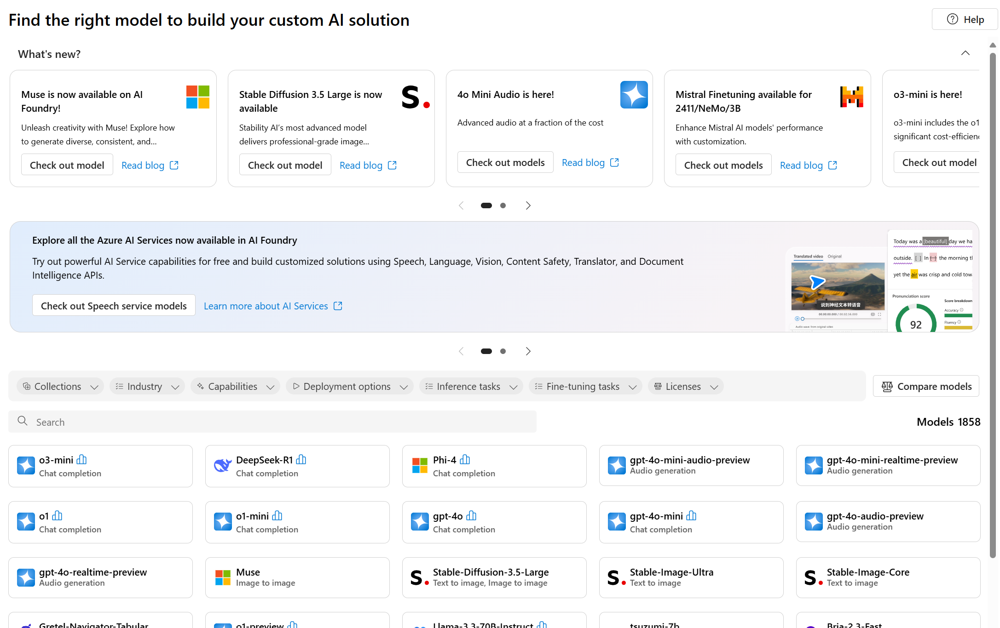
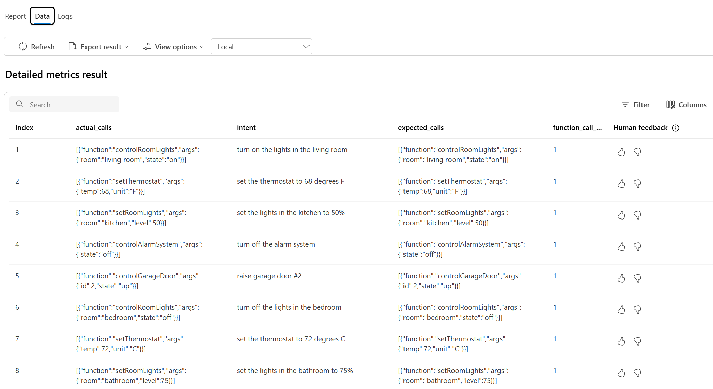

# LLM Function Call Performance Evaluation With Synthetic Eval Data and Azure AI Foundary

This repo demonstrates the following evaluation workflow:

- From a small, representative set of [natural language intents](./intents.txt), generate an [OpenAPI spec](https://spec.openapis.org/oas/latest.html) to describe the desired behaviors

- Using the spec and intents, generate more intent examples to cover a wider range of scenarios

- From the OpenAPI spec, generate function call metadata that describes the necessary function call(s) and arguments needed to fulfill each intent

- Deploy [Azure AI Foundry](https://learn.microsoft.com/en-us/azure/ai-studio/what-is-ai-studio) and supporting services in an Azure subscription

- Use the [Azure AI Foundry Evaluation SDK](https://learn.microsoft.com/en-us/azure/ai-studio/how-to/develop/evaluate-sdk) to eval [function calling](https://platform.openai.com/docs/guides/function-calling) (sometimes called "tool use") performance of various [LLM + config + prompt] combinations

This evaluation workflow produces the core artifacts for reliable LLM function calling in a production solution:

- Choice of appropriate model
- Optimal model [configuration](https://www.promptingguide.ai/introduction/settings) (temperature, top_p, etc.)
- An optimal system prompt
- An OpenAPI spec that fully describes the desired behaviors and maximizes LLM performance
- A set of intents to document targeted capabilities

## Prerequisites

- An Azure subscription
- [Azure CLI](https://learn.microsoft.com/en-us/cli/azure/install-azure-cli)
- [Python 3.8+](https://www.python.org/downloads/)
- [Visual Studio Code](https://code.visualstudio.com/)
- [GitHub Copilot extension](https://marketplace.visualstudio.com/items?itemName=GitHub.copilot)

## Walkthrough

### 1. Generate a spec

Open GitHub Copilot in [edit mode](https://code.visualstudio.com/docs/copilot/copilot-edits#_use-edit-mode). Add [intents.txt](./intents.txt) to the working set and ask Copilot to generate an OpenAPI spec:

```
Use the existing intents as a guide and generate an OpenAPI 3.0 spec that implements the behaviors. Write the spec to 'api.json'.
```

The resulting spec will be a good start, but likely require some fine-tuning (edit manually, or ask Copilot to help!). For example, you might want to parameterize things like room, light or thermostat state, etc.:

Adjust these prompts below based on the exact contents of `api.json`... and don't forget to add it to the Copilot working set.

(_if you prefer, you can see final versions of these artifacts in [./resulting_artifacts](./resulting_artifacts)_)

```
update the spec to parameterize choice of room, for all endpoints where room is specified
```

```
in the spec, parameterize /lights/{room} to allow turning lights on or off
add on/off to the endpoint path and convert it to a PUT
```

```
modify /thermostat endpoint to add temp and unit to the endpoint path. convert from post to put.
```

```
convert /lights/{room} to /lights/{room}/level/{level}. change from post to put
```

```
Parameterize /alarm-system with on/off support... add it to the endpoint path. Convert from POST to PUT
```

```
Update /garage-door to parameterize up/down state and integer id of door. Use path parameters. Change from POST to PUT.
```

### 2. Add more intents

Once you have the spec in a good place, ask Copilot to add more intents to [intents.txt](./intents.txt) to cover a wider range of scenarios:

```
Add 10 more intents to intents.txt. The new intents should match the spec. Don't repeat intents that already exist. Be creative with rooms and other argument values.
```

### 3. Create eval dataset

Now we're ready to create our eval dataset. For Foundry, this is a single jsonl file, with each line containing a) an intent and b) the expected function call metadata for that intent, in JSON format.

Try this:

```
Create a file 'dataset.jsonl'.

For each line in 'intents.txt' add JSON to 'dataset.jsonl', the added content should conform to 'dataset_template.json' and contain the original intent text and the endpoint details (names, argument values, etc.) needed to fulfill the intent against the spec in 'api.json'.
```

### 4. Deploy Azure AI Foundry

Deploy a new [Azure AI Foundry](https://learn.microsoft.com/en-us/azure/ai-studio/concepts/architecture) hub and project. This will require [Owner or Contributor role assignment](https://learn.microsoft.com/en-us/azure/ai-studio/concepts/rbac-ai-studio) in your subscription.

### 5. Deploy a model from Foundry Model Catalog

Follow the guidance found [here](https://learn.microsoft.com/en-us/azure/ai-studio/concepts/deployments-overview).



### 6. Setup local environment

First, create a new Python virtual environment:

```python
python -m venv .venv
source .venv/bin/activate
```

Then install the requirements:

```python
pip install -r requirements.txt
```

Next, login to the Azure CLI. These credentials will be used to access the Azure AI Foundry hub and project:

```bash
az login
```

Finally, copy [.env.template](./.env.template) to `.env` and fill in the required values:

```
FOUNDRY_CONNECTION_STRING=""
MODEL=""
SWAGGER_PATH="./api.json"
TEMPERATURE="0.2"
TOP_P="0.1"
AZURE_SUB_ID=""
AZURE_RESOURCE_GROUP=""
AZURE_AI_PROJECT_NAME=""
```

### 7. Run eval in notebook

Now its time to do an eval run. Open [eval.ipynb](./eval.ipynb) in VS Code and run all cells.

The notebook configures an AI Foundry eval run using [function_call_generator.py](./function_call_generator.py) to generate function call metadata for each intent in `dataset.jsonl`... these 'actual' results are compared to the 'expected' results using [function_call_evaluator.py](./function_call_evaluator.py).

### 8. Review results

Results are logged to the Azure AI Foundry project. You can view the results in the [Foundry portal](https://learn.microsoft.com/en-us/azure/ai-studio/how-to/evaluate-results).

